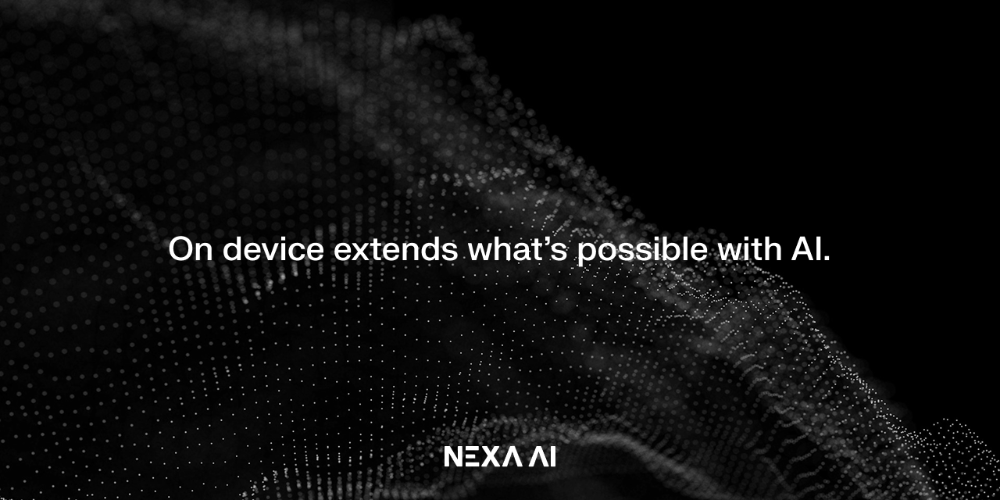

<div align="center">

<h1>Nexa SDK</h1>

  

[![MacOS][MacOS-image]][release-url] [![Linux][Linux-image]][release-url] [![Windows][Windows-image]][release-url]

[](https://github.com/NexaAI/nexa-sdk/releases/latest) [](https://github.com/NexaAI/nexa-sdk/actions/workflows/ci.yaml?query=branch%3Amain) 

<!--   -->

[](https://discord.gg/thRu2HaK4D)

[On-device Model Hub](https://model-hub.nexa4ai.com/) / [Nexa SDK Documentation](https://docs.nexaai.com/)

[release-url]: https://github.com/NexaAI/nexa-sdk/releases
[Windows-image]: https://img.shields.io/badge/windows-0078D4?logo=windows
[MacOS-image]: https://img.shields.io/badge/-MacOS-black?logo=apple
[Linux-image]: https://img.shields.io/badge/-Linux-333?logo=ubuntu

</div>

Nexa SDK is a comprehensive toolkit for supporting **ONNX** and **GGML** models. It supports text generation, image generation, vision-language models (VLM), and text-to-speech (TTS) capabilities. Additionally, it offers an OpenAI-compatible API server with JSON schema mode for function calling and streaming support, and a user-friendly Streamlit UI.

## Features

- **Model Support:**

  - **ONNX & GGML models**
  - **Conversion Engine**
  - **Inference Engine**:
    - **Text Generation**
    - **Image Generation**
    - **Vision-Language Models (VLM)**
    - **Text-to-Speech (TTS)**

Detailed API documentation is available [here](https://docs.nexaai.com/).

- **Server:**
  - OpenAI-compatible API
  - JSON schema mode for function calling
  - Streaming support
- **Streamlit UI** for interactive model deployment and testing

Below is our differentiation from other similar tools:

| **Feature**                | **[Nexa SDK](https://github.com/NexaAI/nexa-sdk)** | **[ollama](https://github.com/ollama/ollama)** | **[Optimum](https://github.com/huggingface/optimum)** | **[LM Studio](https://github.com/lmstudio-ai)** |
|----------------------------|:-------------------------------------------------:|:----------------------------------------------:|:-----------------------------------------------:|:-----------------------------------------------:|
| **GGML Support**            | ✅                                                | ✅                                               | ❌                                               | ✅                                               |
| **ONNX Support**            | ✅                                                | ❌                                               | ✅                                               | ❌                                               |
| **Text Generation**         | ✅                                                | ✅                                               | ✅                                               | ✅                                               |
| **Image Generation**        | ✅                                                | ❌                                               | ❌                                               | ❌                                               |
| **Vision-Language Models**  | ✅                                                | ✅                                               | ✅                                               | ✅                                               |
| **Text-to-Speech**          | ✅                                                | ❌                                               | ✅                                               | ❌                                               |
| **Server Capability**       | ✅                                                | ✅                                               | ✅                                               | ✅                                               |
| **User Interface**          | ✅                                                | ❌                                               | ❌                                               | ✅                                               |


## Installation

We have released pre-built wheels for various Python versions, platforms, and backends for convenient installation on our [index page](https://nexaai.github.io/nexa-sdk/whl/).

#### CPU

```bash
pip install nexaai --prefer-binary --index-url https://nexaai.github.io/nexa-sdk/whl/cpu --extra-index-url https://pypi.org/simple --no-cache-dir
```

#### GPU (Metal)

For the GPU version supporting **Metal (macOS)**:

```bash
CMAKE_ARGS="-DGGML_METAL=ON -DSD_METAL=ON" pip install nexaai --prefer-binary --index-url https://nexaai.github.io/nexa-sdk/whl/metal --extra-index-url https://pypi.org/simple --no-cache-dir
```

<details>
<summary><strong>FAQ: cannot use Metal/GPU on M1</strong></summary>

Try the following command:

```bash
wget https://github.com/conda-forge/miniforge/releases/latest/download/Miniforge3-MacOSX-arm64.sh
bash Miniforge3-MacOSX-arm64.sh
conda create -n nexasdk python=3.10
conda activate nexasdk
CMAKE_ARGS="-DGGML_METAL=ON -DSD_METAL=ON" pip install nexaai --prefer-binary --index-url https://nexaai.github.io/nexa-sdk/whl/metal --extra-index-url https://pypi.org/simple --no-cache-dir
```

</details>

#### GPU (CUDA)

For the GPU version supporting **CUDA (Linux/Windows)**:

```bash
CMAKE_ARGS="-DGGML_CUDA=ON -DSD_CUBLAS=ON" pip install nexaai --prefer-binary --index-url https://nexaai.github.io/nexa-sdk/whl/cu124 --extra-index-url https://pypi.org/simple --no-cache-dir
```

> [!NOTE]
> The CUDA wheels are built with CUDA 12.4, but should be compatible with all CUDA 12.X


<details>
<summary><strong>FAQ: Building Issues for llava</strong></summary>

If you encounter the following issue while building:


try the following command:

```bash
CMAKE_ARGS="-DCMAKE_CXX_FLAGS=-fopenmp" pip install nexaai
```

</details>


### Docker Usage

Note: Docker doesn't support GPU acceleration

```bash
docker pull nexa4ai/sdk:latest
```

replace following placeholder with your path and command

```bash
docker run -v <your_model_dir>:/model -it nexa4ai/sdk:latest [nexa_command] [your_model_relative_path]
```

Example:

```bash
docker run -v /home/ubuntu/.cache/nexa/hub/official:/model -it nexa4ai/sdk:latest nexa gen-text /model/Phi-3-mini-128k-instruct/q4_0.gguf
```

will create an interactive session with text generation

## Supported Models

| Model                                                                                                   | Type            | Format    | Command                            |
| ------------------------------------------------------------------------------------------------------- | --------------- | --------- | ---------------------------------- |
| [octopus-v2](https://www.nexaai.com/NexaAI/Octopus-v2/gguf-q4_0/readme)                                 | NLP             | GGUF      | `nexa run octopus-v2`              |
| [octopus-v4](https://www.nexaai.com/NexaAI/Octopus-v4/gguf-q4_0/readme)                                 | NLP             | GGUF      | `nexa run octopus-v4`              |
| [tinyllama](https://www.nexaai.com/TinyLlama/TinyLlama-1.1B-Chat-v1.0/gguf-fp16/readme)                 | NLP             | GGUF      | `nexa run tinyllama`               |
| [llama2](https://www.nexaai.com/meta/Llama2-7b-chat/gguf-q4_0/readme)                                   | NLP             | GGUF/ONNX | `nexa run llama2`                  |
| [llama3](https://www.nexaai.com/meta/Llama3-8B-Instruct/gguf-q4_0/readme)                               | NLP             | GGUF/ONNX | `nexa run llama3`                  |
| [llama3.1](https://www.nexaai.com/meta/Llama3.1-8B-Instruct/gguf-q4_0/readme)                           | NLP             | GGUF/ONNX | `nexa run llama3.1`                |
| [gemma](https://www.nexaai.com/google/gemma-1.1-2b-instruct/gguf-q4_0/readme)                           | NLP             | GGUF/ONNX | `nexa run gemma`                   |
| [gemma2](https://www.nexaai.com/google/gemma-2-2b-instruct/gguf-q4_0/readme)                            | NLP             | GGUF      | `nexa run gemma2`                  |
| [qwen1.5](https://www.nexaai.com/Qwen/Qwen1.5-7B-Instruct/gguf-q4_0/readme)                             | NLP             | GGUF      | `nexa run qwen1.5`                 |
| [qwen2](https://www.nexaai.com/Qwen/Qwen2-1.5B-Instruct/gguf-q4_0/readme)                               | NLP             | GGUF/ONNX | `nexa run qwen2`                   |
| [mistral](https://www.nexaai.com/mistralai/Mistral-7B-Instruct-v0.3/gguf-q4_0/readme)                   | NLP             | GGUF/ONNX | `nexa run mistral`                 |
| [codegemma](https://www.nexaai.com/google/codegemma-2b/gguf-q4_0/readme)                                | NLP             | GGUF      | `nexa run codegemma`               |
| [codellama](https://www.nexaai.com/meta/CodeLlama-7b-Instruct/gguf-q2_K/readme)                         | NLP             | GGUF      | `nexa run codellama`               |
| [codeqwen](https://www.nexaai.com/Qwen/CodeQwen1.5-7B-Instruct/gguf-q4_0/readme)                        | NLP             | GGUF      | `nexa run codeqwen`                |
| [deepseek-coder](https://www.nexaai.com/DeepSeek/deepseek-coder-1.3b-instruct/gguf-q4_0/readme)         | NLP             | GGUF      | `nexa run deepseek-coder`          |
| [dolphin-mistral](https://www.nexaai.com/CognitiveComputations/dolphin-2.8-mistral-7b/gguf-q4_0/readme) | NLP             | GGUF      | `nexa run dolphin-mistral`         |
| [phi2](https://www.nexaai.com/microsoft/Phi-2/gguf-q4_0/readme)                                         | NLP             | GGUF      | `nexa run phi2`                    |
| [phi3](https://www.nexaai.com/microsoft/Phi-3-mini-128k-instruct/gguf-q4_0/readme)                      | NLP             | GGUF/ONNX | `nexa run phi3`                    |
| [llama2-uncensored](https://www.nexaai.com/georgesung/Llama2-7b-chat-uncensored/gguf-q4_0/readme)       | NLP             | GGUF      | `nexa run llama2-uncensored`       |
| [llama3-uncensored](https://www.nexaai.com/Orenguteng/Llama3-8B-Lexi-Uncensored/gguf-q4_K_M/readme)     | NLP             | GGUF      | `nexa run llama3-uncensored`       |
| [llama2-function-calling](https://www.nexaai.com/Trelis/Llama2-7b-function-calling/gguf-q4_K_M/readme)  | NLP             | GGUF      | `nexa run llama2-function-calling` |
| [nanollava](https://www.nexaai.com/qnguyen3/nanoLLaVA/gguf-fp16/readme)                                 | Multimodal      | GGUF      | `nexa run nanollava`               |
| [llava-phi3](https://www.nexaai.com/xtuner/llava-phi-3-mini/gguf-q4_0/readme)                           | Multimodal      | GGUF      | `nexa run llava-phi3`              |
| [llava-llama3](https://www.nexaai.com/xtuner/llava-llama-3-8b-v1.1/gguf-q4_0/readme)                    | Multimodal      | GGUF      | `nexa run llava-llama3`            |
| [llava1.6-mistral](https://www.nexaai.com/liuhaotian/llava-v1.6-mistral-7b/gguf-q4_0/readme)            | Multimodal      | GGUF      | `nexa run llava1.6-mistral`        |
| [llava1.6-vicuna](https://www.nexaai.com/liuhaotian/llava-v1.6-vicuna-7b/gguf-q4_0/readme)              | Multimodal      | GGUF      | `nexa run llava1.6-vicuna`         |
| [stable-diffusion-v1-4](https://www.nexaai.com/runwayml/stable-diffusion-v1-4/gguf-q4_0/readme)         | Computer Vision | GGUF      | `nexa run sd1-4`                   |
| [stable-diffusion-v1-5](https://www.nexaai.com/runwayml/stable-diffusion-v1-5/gguf-q4_0/readme)         | Computer Vision | GGUF/ONNX | `nexa run sd1-5`                   |
| [lcm-dreamshaper](https://www.nexaai.com/SimianLuo/lcm-dreamshaper-v7/gguf-fp16/readme)                 | Computer Vision | GGUF/ONNX | `nexa run lcm-dreamshaper`         |
| [hassaku-lcm](https://nexaai.com/stablediffusionapi/hassaku-hentai-model-v13-LCM/gguf-fp16/readme)      | Computer Vision | GGUF      | `nexa run hassaku-lcm`             |
| [anything-lcm](https://www.nexaai.com/Linaqruf/anything-v30-LCM/gguf-fp16/readme)                       | Computer Vision | GGUF      | `nexa run anything-lcm`            |
| [faster-whisper-tiny](https://www.nexaai.com/Systran/faster-whisper-tiny/bin-cpu-fp16/readme)           | Audio           | BIN       | `nexa run faster-whisper-tiny`     |
| [faster-whisper-small](https://www.nexaai.com/Systran/faster-whisper-small/bin-cpu-fp16/readme)         | Audio           | BIN       | `nexa run faster-whisper-small`    |
| [faster-whisper-medium](https://www.nexaai.com/Systran/faster-whisper-medium/bin-cpu-fp16/readme)       | Audio           | BIN       | `nexa run faster-whisper-medium`   |
| [faster-whisper-base](https://www.nexaai.com/Systran/faster-whisper-base/bin-cpu-fp16/readme)           | Audio           | BIN       | `nexa run faster-whisper-base`     |
| [faster-whisper-large](https://www.nexaai.com/Systran/faster-whisper-large-v3/bin-cpu-fp16/readme)      | Audio           | BIN       | `nexa run faster-whisper-large`    |

## CLI Reference

Here's a brief overview of the main CLI commands:

- `nexa run`: Run inference for various tasks using GGUF models.
- `nexa onnx`: Run inference for various tasks using ONNX models.
- `nexa server`: Run the Nexa AI Text Generation Service.
- `nexa pull`: Pull a model from official or hub.
- `nexa remove`: Remove a model from local machine.
- `nexa clean`: Clean up all model files.
- `nexa list`: List all models in the local machine.
- `nexa login`: Login to Nexa API.
- `nexa whoami`: Show current user information.
- `nexa logout`: Logout from Nexa API.

For detailed information on CLI commands and usage, please refer to the [CLI Reference](CLI.md) document.


## Start Local Server

To start a local server using models on your local computer, you can use the `nexa server` command. 
For detailed information on server setup, API endpoints, and usage examples, please refer to the [Server Reference](SERVER.md) document.


## Acknowledgements
We would like to thank the following projects:
- [llama.cpp](https://github.com/ggerganov/llama.cpp)
- [stable-diffusion.cpp](https://github.com/leejet/stable-diffusion.cpp)
- [optimum](https://github.com/huggingface/optimum)