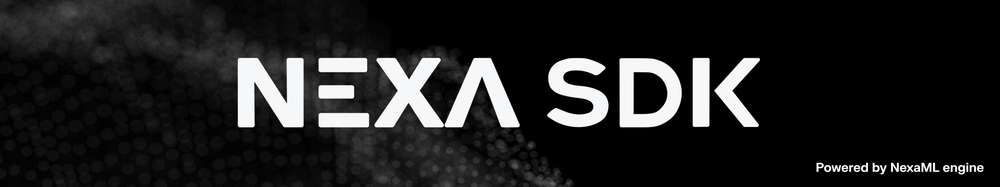

<div align="center" style="text-decoration: none;">
  
  <p style="font-size: 1.3em; font-weight: 600; margin-bottom: 20px;"> 
    <a href="README_zh.md"> 简体中文 </a>
    |
    <a href="README.md"> English </a>
  </p>
  <p style="font-size: 1.3em; font-weight: 600; margin-bottom: 20px;">🤝 Supported chipmakers </p>
    <picture>
      <source srcset="assets/chipmakers-dark.png" media="(prefers-color-scheme: dark)">
      <source srcset="assets/chipmakers.png" media="(prefers-color-scheme: light)">
      
    </picture>
  </p>
  <p>
    <a href="https://www.producthunt.com/products/nexasdk-for-mobile?embed=true&utm_source=badge-top-post-badge&utm_medium=badge&utm_campaign=badge-nexasdk-for-mobile" target="_blank" rel="noopener noreferrer">
        
    </a>
    <a href="https://trendshift.io/repositories/12239" target="_blank" rel="noopener noreferrer">
        
    </a>
  </p>
  <p>
    <a href="https://docs.nexa.ai">
        
    </a>
    <a href="https://sdk.nexa.ai/wishlist">
        
    </a>
    <a href="https://x.com/nexa_ai"></a>
    <a href="https://discord.com/invite/nexa-ai">
        
    </a>
    <a href="https://join.slack.com/t/nexa-ai-community/shared_invite/zt-3837k9xpe-LEty0disTTUnTUQ4O3uuNw">
        
    </a>
  </p>
</div>

# NexaSDK - Run any AI model on any backend

NexaSDK is an easy-to-use developer toolkit for running any AI model locally — across NPUs, GPUs, and CPUs — powered by our **NexaML** engine, built entirely from scratch for peak performance on every hardware stack. Unlike wrappers that depend on existing runtimes, NexaML is a unified inference engine built at the kernel level. It’s what lets NexaSDK achieve Day-0 support for new model architectures (LLM. VLM, CV, Embedding, Rerank, ASR, TTS). NexaML supports 3 model formats: GGUF, MLX, and Nexa AI's own `.nexa` format.

### ⚙️ Differentiation

<div align="center">

| Features                                    | **NexaSDK**                                                | **Ollama** | **llama.cpp** | **LM Studio** |
| ------------------------------------------- | ---------------------------------------------------------- | ---------- | ------------- | ------------- |
| NPU support                                 | ✅ NPU-first                                               | ⚠️         | ⚠️            | ❌            |
| Android/iOS SDK support                     | ✅ NPU/GPU/CPU support                                     | ⚠️         | ⚠️            | ❌            |
| Linux support (Docker image)                | ✅                                                         | ✅         | ✅            | ❌            |
| Support any model in GGUF, MLX, NEXA format | ✅ Low-level Control                                       | ❌         | ⚠️            | ❌            |
| Full multimodality support                  | ✅ Image, Audio, Text, Embedding, Rerank, ASR, TTS         | ⚠️         | ⚠️            | ⚠️            |
| Cross-platform support                      | ✅ Desktop, Mobile (Android, iOS), Automotive, IoT (Linux) | ⚠️         | ⚠️            | ⚠️            |
| One line of code to run                     | ✅                                                         | ✅         | ⚠️            | ✅            |
| OpenAI-compatible API + Function calling    | ✅                                                         | ✅         | ✅            | ✅            |

<p align="center" style="margin-top:14px">
  <i>
      <b>Legend:</b>
      <span title="Full support">✅ Supported</span> &nbsp; | &nbsp;
      <span title="Partial or limited support">⚠️ Partial or limited support </span> &nbsp; | &nbsp;
      <span title="Not Supported">❌ No</span>
  </i>
</p>
</div>

## Recent Wins

- 📣 **NexaSDK for Android** is highlighted by [Qualcomm blog](https://www.qualcomm.com/developer/blog/2025/11/nexa-ai-for-android-simple-way-to-bring-on-device-ai-to-smartphones-with-snapdragon) as "a simple way to bring on-device AI to smartphones with Snapdragon", and **NexaML engine** is featured in [Qualcomm blog](https://www.qualcomm.com/developer/blog/2025/09/omnineural-4b-nexaml-qualcomm-hexagon-npu) as "Revolutionizing On-Device AI Inferencing".
- 📣 Release Nexa AI’s **AutoNeural-VL-1.5B**, an NPU-native vision–language model built for real-time in-car assistants, delivering **14×** lower latency, **3×** faster decode, and **4×** longer context on Qualcomm SA8295P — now also runnable on Qualcomm X Elite laptops.
- 📣 Support Mistral AI's **Ministral-3-3B** across Qualcomm Hexagon NPU, Apple Neural Engine, GPU and CPU.
- 📣 Release **Linux SDK** for NPU/GPU/CPU. See [Linux SDK Doc](https://docs.nexa.ai/nexa-sdk-docker/overview).
- 📣 Support **Apple Neural Engine** for [Granite-4.0](https://huggingface.co/NexaAI/Granite-4-Micro-ANE), [Qwen3](https://huggingface.co/NexaAI/Qwen3-0.6B-ANE), [Gemma3](https://huggingface.co/NexaAI/Gemma3-1B-ANE), and [Parakeetv3](https://huggingface.co/NexaAI/parakeet-tdt-0.6b-v3-ane). Download NexaSDK for ANE [here](https://nexa-model-hub-bucket.s3.us-west-1.amazonaws.com/public/nexa_sdk/downloads/nexa-cli_macos_arm64_ane.pkg).
- 📣 Support **Android SDK** for NPU/GPU/CPU. See [Android SDK Doc](https://docs.nexa.ai/nexa-sdk-android/overview) and [Android SDK Demo App](bindings/android/README.md).
- 📣 Support **SDXL-turbo** image generation on AMD NPU. See [AMD blog : Advancing AI with Nexa AI](https://www.amd.com/en/developer/resources/technical-articles/2025/advancing-ai-with-nexa-ai--image-generation-on-amd-npu-with-sdxl.html).
- Support Android **Python SDK** for NPU/GPU/CPU. See [Android Python SDK Doc](https://docs.nexa.ai/nexa-sdk-android/python) and [Android Python SDK Demo App](bindings/android/README.md).
- 📣 Day-0 Support for **Qwen3-VL-4B and 8B** in GGUF, MLX, .nexa format for NPU/GPU/CPU. We are the only framework that supports the GGUF format. [Featured in Qwen's post about our partnership](https://x.com/Alibaba_Qwen/status/1978154384098754943).
- 📣 Day-0 Support for **IBM Granite 4.0** on NPU/GPU/CPU. [NexaML engine were featured right next to vLLM, llama.cpp, and MLX in IBM's blog](https://x.com/IBM/status/1978154384098754943).
- 📣 Day-0 Support for **Google EmbeddingGemma** on NPU. We are [featured in Google's social post](https://x.com/googleaidevs/status/1969188152049889511).
- 📣 Supported **vision capability for Gemma3n**: First-ever [Gemma-3n](https://sdk.nexa.ai/model/Gemma3n-E4B) **multimodal** inference for GPU & CPU, in GGUF format.
- 📣 **Intel NPU** Support [DeepSeek-r1-distill-Qwen-1.5B](https://sdk.nexa.ai/model/DeepSeek-R1-Distill-Qwen-1.5B-Intel-NPU) and [Llama3.2-3B](https://sdk.nexa.ai/model/Llama3.2-3B-Intel-NPU)
- 📣 **Apple Neural Engine** Support for real-time speech recognition with [Parakeet v3 model](https://sdk.nexa.ai/model/parakeet-v3-ane)

# Quick Start

## Step 1: Download Nexa CLI with one click

### Windows

- [arm64 with Qualcomm NPU support](https://public-storage.nexa4ai.com/nexa_sdk/downloads/nexa-cli_windows_arm64.exe)
- [x86_64 with Intel / AMD NPU support](https://public-storage.nexa4ai.com/nexa_sdk/downloads/nexa-cli_windows_x86_64.exe)

### Linux

#### For arm64 (Qualcomm NPU)

```bash
curl -fsSL https://github.com/NexaAI/nexa-sdk/releases/latest/download/nexa-cli_linux_arm64.sh -o install.sh && chmod +x install.sh && ./install.sh && rm install.sh
```

#### For x86_64:

```bash
curl -fsSL https://github.com/NexaAI/nexa-sdk/releases/latest/download/nexa-cli_linux_x86_64.sh -o install.sh && chmod +x install.sh && ./install.sh && rm install.sh
```

### macOS

- [arm64 with MLX / ANE support](https://public-storage.nexa4ai.com/nexa_sdk/downloads/nexa-cli_macos_arm64.pkg)
- [x86_64](https://public-storage.nexa4ai.com/nexa_sdk/downloads/nexa-cli_macos_x86_64.pkg)

#### Uninstall

```bash
sudo rm -r /opt/nexa_sdk
sudo rm /usr/local/bin/nexa
# if you want to remove data as well
# rm -r $HOME/.cache/nexa.ai
```

## Step 2: Run models with one line of code

You can run any compatible GGUF, MLX, or nexa model from 🤗 Hugging Face by using the `nexa infer <full repo name>`.

### GGUF models

> [!TIP]
> GGUF runs on macOS, Linux, and Windows on CPU/GPU. Note certain GGUF models are only supported by NexaSDK (e.g. DeepSeek-OCR).

📝 Run and chat with LLMs, e.g. Qwen3:

```bash
nexa infer ggml-org/Qwen3-1.7B-GGUF
```

🖼️ Run and chat with Multimodal models, e.g. Qwen3-VL-4B:

```bash
nexa infer NexaAI/Qwen3-VL-4B-Instruct-GGUF
```

### MLX models

> [!TIP]
> MLX is macOS-only (Apple Silicon). Many MLX models in the Hugging Face mlx-community organization have quality issues and may not run reliably.
> We recommend starting with models from our curated [NexaAI Collection](https://huggingface.co/NexaAI/collections) for best results. For example

📝 Run and chat with LLMs, e.g. Qwen3:

```bash
nexa infer NexaAI/Qwen3-4B-4bit-MLX
```

🖼️ Run and chat with Multimodal models, e.g. Gemma3n:

```bash
nexa infer NexaAI/gemma-3n-E4B-it-4bit-MLX
```

### Qualcomm NPU models

> [!TIP]
> You need to download the [arm64 with Qualcomm NPU support](https://public-storage.nexa4ai.com/nexa_sdk/downloads/nexa-cli_windows_arm64.exe) and make sure you have Snapdragon® X Elite chip on your laptop.

#### Quick Start (Windows arm64, Snapdragon X Elite)

1. **Login & Get Access Token (required for Pro Models)**

   - Create an account at [sdk.nexa.ai](https://sdk.nexa.ai)
   - Go to **Deployment → Create Token**
   - Run this once in your terminal (replace with your token):
     ```bash
     nexa config set license '<your_token_here>'
     ```

2. Run and chat with our multimodal model, OmniNeural-4B, or other models on NPU

```bash
nexa infer NexaAI/OmniNeural-4B
nexa infer NexaAI/Granite-4-Micro-NPU
nexa infer NexaAI/Qwen3-VL-4B-Instruct-NPU
```

## CLI Reference

| Essential Command                   | What it does                             |
| ----------------------------------- | ---------------------------------------- |
| `nexa -h`                           | show all CLI commands                    |
| `nexa pull <repo>`                  | Interactive download & cache of a model  |
| `nexa infer <repo>`                 | Local inference                          |
| `nexa list`                         | Show all cached models with sizes        |
| `nexa remove <repo>` / `nexa clean` | Delete one / all cached models           |
| `nexa serve --host 127.0.0.1:8080`  | Launch OpenAI‑compatible REST server     |
| `nexa run <repo>`                   | Chat with a model via an existing server |

👉 To interact with multimodal models, you can drag photos or audio clips directly into the CLI — you can even drop multiple images at once!

See [CLI Reference](https://nexaai.mintlify.app/nexa-sdk-go/NexaCLI) for full commands.

### Import model from local filesystem

```bash
# hf download <model> --local-dir /path/to/modeldir
nexa pull <model> --model-hub localfs --local-path /path/to/modeldir
```

## 🎯 You Decide What Model We Support Next

**[Nexa Wishlist](https://sdk.nexa.ai/wishlist)** — Request and vote for the models you want to run on-device.

Drop a Hugging Face repo ID, pick your preferred backend (GGUF, MLX, or Nexa format for Qualcomm + Apple NPUs), and watch the community's top requests go live in NexaSDK.

👉 **[Vote now at sdk.nexa.ai/wishlist](https://sdk.nexa.ai/wishlist)**

## Acknowledgements

We would like to thank the following projects:
- [ggml](https://github.com/ggml-org/ggml)
- [mlx-lm](https://github.com/ml-explore/mlx-lm)
- [mlx-vlm](https://github.com/Blaizzy/mlx-vlm)
- [mlx-audio](https://github.com/Blaizzy/mlx-audio)

## Join Builder Bounty Program

Earn up to 1,500 USD for building with NexaSDK.


Learn more in our [Participant Details](https://docs.nexa.ai/community/builder-bounty).

## License

NexaSDK uses a dual licensing model:

### CPU/GPU Components
Licensed under [Apache License 2.0](LICENSE).

### NPU Components
- **Personal Use**: Free license key available from [Nexa AI Model Hub](https://sdk.nexa.ai/model). Each key activates 1 device for NPU usage.
- **Commercial Use**: Contact [hello@nexa.ai](mailto:hello@nexa.ai) for licensing.