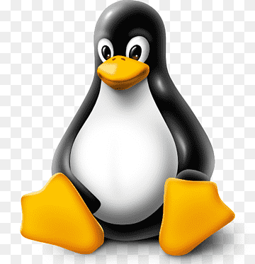

<video src="https://user-images.githubusercontent.com/assets/375570dc-0e7a-4a99-840d-c1ef6502e5aa.mp4" autoplay muted loop playsinline style="max-width: 100%;"></video>

<h1>Nexa SDK - Local On-Device Inference Framework</h1>

[release-url]: https://github.com/NexaAI/nexa-sdk/releases
[Windows-image]: https://img.shields.io/badge/windows-0078D4?logo=windows
[MacOS-image]: https://img.shields.io/badge/-MacOS-black?logo=apple
[Linux-image]: https://img.shields.io/badge/-Linux-333?logo=ubuntu

[![MacOS][MacOS-image]][release-url] [![Linux][Linux-image]][release-url] [![Windows][Windows-image]][release-url] [](https://swiftpackageindex.com/NexaAI/nexa-sdk) [](https://github.com/NexaAI/nexa-sdk/actions/workflows/ci.yaml?query=branch%3Amain)  [](https://github.com/NexaAI/nexa-sdk/releases/latest)

[**On-Device Model Hub**](https://nexa.ai/models) | [**Documentation**](https://docs.nexa.ai/) | [**Discord**](https://discord.gg/thRu2HaK4D) | [**Blogs**](https://nexa.ai/blogs) | [**X (Twitter)**](https://x.com/nexa_ai)

**Nexa SDK** is a local on-device inference framework for ONNX and GGML models, supporting text generation, image generation, vision-language models (VLM), audio-language models, speech-to-text (ASR), and text-to-speech (TTS) capabilities. Installable via Python Package or Executable Installer.

### Features

- **Device Support:** CPU, GPU (CUDA, Metal, ROCm), iOS
- **Server:** OpenAI-compatible API, JSON schema for function calling and streaming support
- **Local UI:** Streamlit for interactive model deployment and testing

## Latest News 🔥
- Support Nexa AI's own vision language model (0.9B parameters): `nexa run omnivision` and audio language model (2.9B parameters): `nexa run omniaudio`
- Support audio language model: `nexa run qwen2audio`, **we are the first open-source toolkit to support audio language model with GGML tensor library.**
- Support iOS Swift binding for local inference on **iOS mobile** devices.
- Support embedding model: `nexa embed <model_path> <prompt>`
- Support pull and run supported Computer Vision models in GGUF format from HuggingFace or ModelScope: `nexa run -hf <hf_model_id> -mt COMPUTER_VISION` or `nexa run -ms <ms_model_id> -mt COMPUTER_VISION`
- Support pull and run NLP models in GGUF format from HuggingFace or ModelScope: `nexa run -hf <hf_model_id> -mt NLP` or `nexa run -ms <ms_model_id> -mt NLP`

Welcome to submit your requests through [issues](https://github.com/NexaAI/nexa-sdk/issues/new/choose), we ship weekly.

## Install Option 1: Executable Installer

<p>
    <a href="https://public-storage.nexa4ai.com/nexa-sdk-executable-installer/nexa-sdk-0.0.9.2-macos-installer.pkg">
         <strong> macOS Installer </strong>
    </a>
</p>

<p>
    <a href="https://public-storage.nexa4ai.com/nexa-sdk-executable-installer/nexa-sdk-0.0.9.2-windows-setup.exe">
         <strong>Windows Installer</strong>
    </a>
</p>

<strong>  Linux Installer </strong>

```bash
curl -fsSL https://public-storage.nexa4ai.com/install.sh | sh
```

Currently, executable installer does not support local UI. For local UI, please install using python package below.

<details>
<summary><strong>FAQ: cannot use executable with nexaai python package already installed</strong></summary>

Try using `nexa-exe` instead:

```bash
nexa-exe <command>
```

</details>

## Install Option 2: Python Package

We have released pre-built wheels for various Python versions, platforms, and backends for convenient installation on our [index page](https://nexaai.github.io/nexa-sdk/whl/).

<details> <summary><strong style="font-size: 1.2em;">CPU</strong></summary>

```bash
pip install nexaai --prefer-binary --index-url https://nexaai.github.io/nexa-sdk/whl/cpu --extra-index-url https://pypi.org/simple --no-cache-dir
```

</details>

<details> <summary><strong style="font-size: 1.2em;">Apple GPU (Metal)</strong></summary>

For the GPU version supporting **Metal (macOS)**:

```bash
CMAKE_ARGS="-DGGML_METAL=ON -DSD_METAL=ON" pip install nexaai --prefer-binary --index-url https://nexaai.github.io/nexa-sdk/whl/metal --extra-index-url https://pypi.org/simple --no-cache-dir
```

<details>
<summary><strong>FAQ: cannot use Metal/GPU on M1</strong></summary>

Try the following command:

```bash
wget https://github.com/conda-forge/miniforge/releases/latest/download/Miniforge3-MacOSX-arm64.sh
bash Miniforge3-MacOSX-arm64.sh
conda create -n nexasdk python=3.10
conda activate nexasdk
CMAKE_ARGS="-DGGML_METAL=ON -DSD_METAL=ON" pip install nexaai --prefer-binary --index-url https://nexaai.github.io/nexa-sdk/whl/metal --extra-index-url https://pypi.org/simple --no-cache-dir
```

</details>
</details>

<details> <summary><strong style="font-size: 1.2em;">Nvidia GPU (CUDA)</strong></summary>

To install with CUDA support, make sure you have [CUDA Toolkit 12.0 or later](https://developer.nvidia.com/cuda-12-0-0-download-archive) installed.

For **Linux**:

```bash
CMAKE_ARGS="-DGGML_CUDA=ON -DSD_CUBLAS=ON" pip install nexaai --prefer-binary --index-url https://nexaai.github.io/nexa-sdk/whl/cu124 --extra-index-url https://pypi.org/simple --no-cache-dir
```

For **Windows PowerShell**:

```bash
$env:CMAKE_ARGS="-DGGML_CUDA=ON -DSD_CUBLAS=ON"; pip install nexaai --prefer-binary --index-url https://nexaai.github.io/nexa-sdk/whl/cu124 --extra-index-url https://pypi.org/simple --no-cache-dir
```

For **Windows Command Prompt**:

```bash
set CMAKE_ARGS="-DGGML_CUDA=ON -DSD_CUBLAS=ON" & pip install nexaai --prefer-binary --index-url https://nexaai.github.io/nexa-sdk/whl/cu124 --extra-index-url https://pypi.org/simple --no-cache-dir
```

For **Windows Git Bash**:

```bash
CMAKE_ARGS="-DGGML_CUDA=ON -DSD_CUBLAS=ON" pip install nexaai --prefer-binary --index-url https://nexaai.github.io/nexa-sdk/whl/cu124 --extra-index-url https://pypi.org/simple --no-cache-dir
```

<details>
<summary><strong>FAQ: Building Issues for llava</strong></summary>

If you encounter the following issue while building:


try the following command:

```bash
CMAKE_ARGS="-DCMAKE_CXX_FLAGS=-fopenmp" pip install nexaai
```

</details>

</details>

<details> <summary><strong style="font-size: 1.2em;">AMD GPU (ROCm)</strong></summary>

To install with ROCm support, make sure you have [ROCm 6.2.1 or later](https://rocm.docs.amd.com/projects/install-on-linux/en/docs-6.2.1/install/quick-start.html) installed.

For **Linux**:

```bash
CMAKE_ARGS="-DGGML_HIPBLAS=on" pip install nexaai --prefer-binary --index-url https://nexaai.github.io/nexa-sdk/whl/rocm621 --extra-index-url https://pypi.org/simple --no-cache-dir
```

</details>

<details> <summary><strong style="font-size: 1.2em;">GPU (Vulkan)</strong></summary>

To install with Vulkan support, make sure you have [Vulkan SDK 1.3.261.1 or later](https://vulkan.lunarg.com/sdk/home) installed.

For **Windows PowerShell**:

```bash
$env:CMAKE_ARGS="-DGGML_VULKAN=on"; pip install nexaai --prefer-binary --index-url https://nexaai.github.io/nexa-sdk/whl/vulkan --extra-index-url https://pypi.org/simple --no-cache-dir
```

For **Windows Command Prompt**:

```bash
set CMAKE_ARGS="-DGGML_VULKAN=on" & pip install nexaai --prefer-binary --index-url https://nexaai.github.io/nexa-sdk/whl/vulkan --extra-index-url https://pypi.org/simple --no-cache-dir
```

For **Windows Git Bash**:

```bash
CMAKE_ARGS="-DGGML_VULKAN=on" pip install nexaai --prefer-binary --index-url https://nexaai.github.io/nexa-sdk/whl/vulkan --extra-index-url https://pypi.org/simple --no-cache-dir
```

</details>

<details> <summary><strong style="font-size: 1.2em;">Local Build</strong></summary>

How to clone this repo

```bash
git clone --recursive https://github.com/NexaAI/nexa-sdk
```

If you forget to use `--recursive`, you can use below command to add submodule

```bash
git submodule update --init --recursive
```

Then you can build and install the package

```bash
pip install -e .
```

</details>

## Differentiation

Below is our differentiation from other similar tools:

| **Feature**                | **[Nexa SDK](https://github.com/NexaAI/nexa-sdk)** | **[ollama](https://github.com/ollama/ollama)** | **[Optimum](https://github.com/huggingface/optimum)** | **[LM Studio](https://github.com/lmstudio-ai)** |
| -------------------------- | :------------------------------------------------: | :--------------------------------------------: | :---------------------------------------------------: | :---------------------------------------------: |
| **GGML Support**           |                         ✅                         |                       ✅                       |                          ❌                           |                       ✅                        |
| **ONNX Support**           |                         ✅                         |                       ❌                       |                          ✅                           |                       ❌                        |
| **Text Generation**        |                         ✅                         |                       ✅                       |                          ✅                           |                       ✅                        |
| **Image Generation**       |                         ✅                         |                       ❌                       |                          ❌                           |                       ❌                        |
| **Vision-Language Models** |                         ✅                         |                       ✅                       |                          ✅                           |                       ✅                        |
| **Audio-Language Models** |                         ✅                         |                       ❌                       |                          ❌                           |                       ❌                        |
| **Text-to-Speech**         |                         ✅                         |                       ❌                       |                          ✅                           |                       ❌                        |
| **Server Capability**      |                         ✅                         |                       ✅                       |                          ✅                           |                       ✅                        |
| **User Interface**         |                         ✅                         |                       ❌                       |                          ❌                           |                       ✅                        |
| **Executable Installation**         |                         ✅                         |                       ✅                       |                          ❌                           |                       ✅                        |

## Supported Models & Model Hub

Our on-device model hub offers all types of quantized models (text, image, audio, multimodal) with filters for RAM, file size, Tasks, etc. to help you easily explore models with UI. Explore on-device models at [On-device Model Hub](https://model-hub.nexa4ai.com/)

Supported model examples (full list at [Model Hub](https://nexa.ai/models)):
| Model | Type | Format | Command |
| ------------------------------------------------------------------------------------------------------- | --------------- | --------- | -------------------------------------- |
| [omniaudio](https://nexa.ai/NexaAI/omniaudio/gguf-q4_0/readme) | AudioLM | GGUF | `nexa run omniaudio` |
| [qwen2audio](https://www.nexaai.com/qnguyen3/nanoLLaVA/gguf-fp16/readme) | AudioLM | GGUF | `nexa run qwen2audio` |
| [octopus-v2](https://www.nexaai.com/NexaAI/Octopus-v2/gguf-q4_0/readme) | Function Call | GGUF | `nexa run octopus-v2` |
| [octo-net](https://www.nexaai.com/NexaAI/Octo-net/gguf-q4_0/readme) | Text | GGUF | `nexa run octo-net` |
| [omnivision](https://nexa.ai/NexaAI/omnivision/gguf-fp16/readme) | Multimodal | GGUF | `nexa run omnivision` |
| [nanollava](https://www.nexaai.com/qnguyen3/nanoLLaVA/gguf-fp16/readme) | Multimodal | GGUF | `nexa run nanollava` |
| [llava-phi3](https://www.nexaai.com/xtuner/llava-phi-3-mini/gguf-q4_0/readme) | Multimodal | GGUF | `nexa run llava-phi3` |
| [llava-llama3](https://www.nexaai.com/xtuner/llava-llama-3-8b-v1.1/gguf-q4_0/readme) | Multimodal | GGUF | `nexa run llava-llama3` |
| [llava1.6-mistral](https://www.nexaai.com/liuhaotian/llava-v1.6-mistral-7b/gguf-q4_0/readme) | Multimodal | GGUF | `nexa run llava1.6-mistral` |
| [llava1.6-vicuna](https://www.nexaai.com/liuhaotian/llava-v1.6-vicuna-7b/gguf-q4_0/readme) | Multimodal | GGUF | `nexa run llava1.6-vicuna` |
| [llama3.2](https://nexaai.com/meta/Llama3.2-3B-Instruct/gguf-q4_0/readme) | Text | GGUF | `nexa run llama3.2` |
| [llama3-uncensored](https://www.nexaai.com/Orenguteng/Llama3-8B-Lexi-Uncensored/gguf-q4_K_M/readme) | Text | GGUF | `nexa run llama3-uncensored` |
| [gemma2](https://www.nexaai.com/google/gemma-2-2b-instruct/gguf-q4_0/readme) | Text | GGUF | `nexa run gemma2` |
| [qwen2.5](https://www.nexaai.com/Qwen/Qwen2.5-1.5B-Instruct/gguf-q4_0/readme) | Text | GGUF | `nexa run qwen2.5` |
| [mathqwen](https://nexaai.com/Qwen/Qwen2.5-Math-1.5B-Instruct/gguf-q4_0/readme) | Text | GGUF | `nexa run mathqwen` |
| [codeqwen](https://www.nexaai.com/Qwen/CodeQwen1.5-7B-Instruct/gguf-q4_0/readme) | Text | GGUF | `nexa run codeqwen` |
| [mistral](https://www.nexaai.com/mistralai/Mistral-7B-Instruct-v0.3/gguf-q4_0/readme) | Text | GGUF/ONNX | `nexa run mistral` |
| [deepseek-coder](https://www.nexaai.com/DeepSeek/deepseek-coder-1.3b-instruct/gguf-q4_0/readme) | Text | GGUF | `nexa run deepseek-coder` |
| [phi3.5](https://nexaai.com/microsoft/Phi-3.5-mini-instruct/gguf-q4_0/readme) | Text | GGUF | `nexa run phi3.5` |
| [openelm](https://nexaai.com/apple/OpenELM-3B/gguf-q4_K_M/readme) | Text | GGUF | `nexa run openelm` |
| [stable-diffusion-v2-1](https://nexaai.com/StabilityAI/stable-diffusion-v2-1/gguf-q4_0/readme) | Image Generation | GGUF | `nexa run sd2-1` |
| [stable-diffusion-3-medium](https://nexaai.com/StabilityAI/stable-diffusion-3-medium/gguf-q4_0/readme) | Image Generation | GGUF | `nexa run sd3` |
| [FLUX.1-schnell](https://nexaai.com/BlackForestLabs/FLUX.1-schnell/gguf-q4_0/readme) | Image Generation | GGUF | `nexa run flux` |
| [lcm-dreamshaper](https://www.nexaai.com/SimianLuo/lcm-dreamshaper-v7/gguf-fp16/readme) | Image Generation | GGUF/ONNX | `nexa run lcm-dreamshaper` |
| [whisper-large-v3-turbo](https://nexaai.com/Systran/faster-whisper-large-v3-turbo/bin-cpu-fp16/readme) | Speech-to-Text | BIN | `nexa run faster-whisper-large-turbo` |
| [whisper-tiny.en](https://nexaai.com/openai/whisper-tiny.en/onnx-cpu-fp32/readme) | Speech-to-Text | ONNX | `nexa run whisper-tiny.en` |
| [mxbai-embed-large-v1](https://nexa.ai/mixedbread-ai/mxbai-embed-large-v1/gguf-fp16/readme) | Embedding | GGUF | `nexa embed mxbai` |
| [nomic-embed-text-v1.5](https://nexa.ai/nomic-ai/nomic-embed-text-v1.5/gguf-fp16/readme) | Embedding | GGUF | `nexa embed nomic` |
| [all-MiniLM-L12-v2](https://nexa.ai/sentence-transformers/all-MiniLM-L12-v2/gguf-fp16/readme) | Embedding | GGUF | `nexa embed all-MiniLM-L12-v2:fp16` |
| [bark-small](https://nexa.ai/suno/bark-small/gguf-fp16/readme) | Text-to-Speech | GGUF | `nexa run bark-small:fp16` |

## Run Models from 🤗 HuggingFace or 🤖 ModelScope
You can pull, convert (to .gguf), quantize and run [llama.cpp supported](https://github.com/ggerganov/llama.cpp#description) text generation models from HF or MS with Nexa SDK.
### Run .gguf File
Use `nexa run -hf <hf-model-id>` or `nexa run -ms <ms-model-id>` to run models with provided .gguf files:
```bash
nexa run -hf Qwen/Qwen2.5-Coder-7B-Instruct-GGUF
```
```bash
nexa run -ms Qwen/Qwen2.5-Coder-7B-Instruct-GGUF
```
> **Note:** You will be prompted to select a single .gguf file. If your desired quantization version has multiple split files (like fp16-00001-of-00004), please use Nexa's conversion tool (see below) to convert and quantize the model locally.
### Convert .safetensors Files
Install [Nexa Python package](https://github.com/NexaAI/nexa-sdk?tab=readme-ov-file#install-option-2-python-package), and install Nexa conversion tool with `pip install "nexaai[convert]"`, then convert models from huggingface with `nexa convert <hf-model-id>`:
```bash
nexa convert HuggingFaceTB/SmolLM2-135M-Instruct
```
Or you can convert models from ModelScope with `nexa convert -ms <ms-model-id>`:
```bash
nexa convert -ms Qwen/Qwen2.5-7B-Instruct
```
> **Note:** Check our [leaderboard](https://nexa.ai/leaderboard) for performance benchmarks of different quantized versions of mainstream language models and [HuggingFace docs](https://huggingface.co/docs/optimum/en/concept_guides/quantization) to learn about quantization options.

📋 You can view downloaded and converted models with `nexa list`

## Documentation

> [!NOTE]
>
> 1. If you want to use <strong>ONNX model</strong>, just replace `pip install nexaai` with `pip install "nexaai[onnx]"` in provided commands.
> 2. If you want to <strong>run benchmark evaluation</strong>, just replace `pip install nexaai` with `pip install "nexaai[eval]"` in provided commands.
> 3. If you want to <strong>convert and quantize huggingface models to GGUF models</strong>, just replace `pip install nexaai` with `pip install "nexaai[convert]"` in provided commands.
> 4. For Chinese developers, we recommend you to use <strong>Tsinghua Open Source Mirror</strong> as extra index url, just replace `--extra-index-url https://pypi.org/simple` with `--extra-index-url https://pypi.tuna.tsinghua.edu.cn/simple` in provided commands.

### CLI Reference

Here's a brief overview of the main CLI commands:

- `nexa run`: Run inference for various tasks using GGUF models.
- `nexa onnx`: Run inference for various tasks using ONNX models.
- `nexa convert`: Convert and quantize huggingface models to GGUF models.
- `nexa server`: Run the Nexa AI Text Generation Service.
- `nexa eval`: Run the Nexa AI Evaluation Tasks.
- `nexa pull`: Pull a model from official or hub.
- `nexa remove`: Remove a model from local machine.
- `nexa clean`: Clean up all model files.
- `nexa list`: List all models in the local machine.
- `nexa login`: Login to Nexa API.
- `nexa whoami`: Show current user information.
- `nexa logout`: Logout from Nexa API.

For detailed information on CLI commands and usage, please refer to the [CLI Reference](CLI.md) document.

### Start Local Server

To start a local server using models on your local computer, you can use the `nexa server` command.
For detailed information on server setup, API endpoints, and usage examples, please refer to the [Server Reference](SERVER.md) document.

### Swift Package

**[Swift SDK](https://github.com/NexaAI/nexa-sdk/tree/main/swift):** Provides a Swifty API, allowing Swift developers to easily integrate and use llama.cpp models in their projects.

[**More Docs**](https://docs.nexa.ai/)

## Acknowledgements

We would like to thank the following projects:

- [llama.cpp](https://github.com/ggerganov/llama.cpp)
- [stable-diffusion.cpp](https://github.com/leejet/stable-diffusion.cpp)
- [bark.cpp](https://github.com/PABannier/bark.cpp)
- [optimum](https://github.com/huggingface/optimum)
