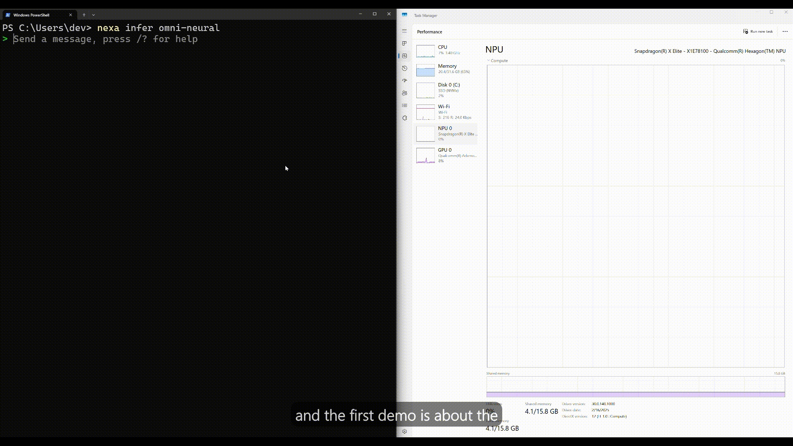
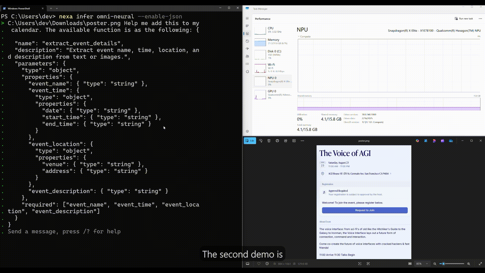
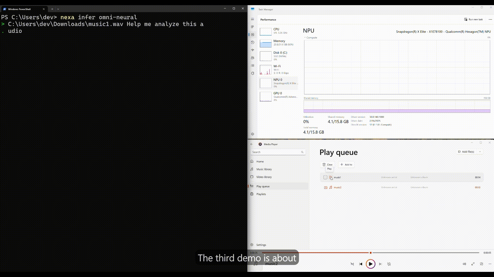

<div align="center">
  <p>
      
  </p>

  <p align="center">
    <a href="https://docs.nexa.ai">
        
    </a>
   <a href="https://x.com/nexa_ai"></a>
    <a href="https://discord.com/invite/nexa-ai">
        
    </a>
    <a href="https://join.slack.com/t/nexa-ai-community/shared_invite/zt-3837k9xpe-LEty0disTTUnTUQ4O3uuNw">
        
    </a>
</p>
  
  
  

</div>

# Nexa SDK

Nexa SDK is an on-device inference framework that runs any model on any device, across any backend. It runs on CPUs, GPUs, NPUs with backend support for CUDA, Metal, Vulkan, and Qualcomm / Intel / AMD NPU. It handles multiple input modalities including text 📝, image 🖼️, and audio 🎧. The SDK includes an OpenAI-compatible API server with support for JSON schema-based function calling and streaming. It supports model formats such as GGUF, MLX, Nexa AI's own `.nexa` format, enabling efficient quantized inference across diverse platforms.

## Qualcomm NPU PC Demos

<table>
<tr>
<td width="50%">

<p align="center"><b>🖼️ Multi-Image Reasoning</b><br>Spot the difference across two images in multi-round dialogue.</p>
</td>

<td width="50%">

<p align="center"><b>🎤 Image + Text → Function Call</b><br>Snap a poster, add a voice note, and AI agent creates a calendar event.</p>
</td>
</tr>
<tr>
<td colspan="2" align="center">

<p align="center"><b>🎶 Multi-Audio Comparison</b><br>Tell the difference between two music clips locally.</p>
</td>
</tr>
</table>


## Recent updates

#### 📣  **2025.10.01: AMD NPU Support**
- Image Generation with [SDXL](https://huggingface.co/NexaAI/sdxl-turbo-amd-npu) on AMD NPU

#### 📣  **2025.09.23: Intel NPU Support**
- LLM inference with [DeepSeek-r1-distill-Qwen-1.5B](https://sdk.nexa.ai/model/DeepSeek-R1-Distill-Qwen-1.5B-Intel-NPU) and [Llama3.2-3B](https://sdk.nexa.ai/model/Llama3.2-3B-Intel-NPU) on Intel NPU

#### 📣  **2025.09.22: Apple Neural Engine (ANE) Support**
- Real-time speech recognition with [Parakeet v3 model](https://sdk.nexa.ai/model/parakeet-v3-ane)

#### 📣  **2025.09.15: New Models Support**
- First-ever [Gemma-3n](https://sdk.nexa.ai/model/Gemma3n-E4B) **multimodal** inference for GPU & CPU, in GGUF format.
- [SDXL image generation](https://sdk.nexa.ai/model/Prefect-illustrious-XL-v2.0p) from Civitai for GPU
- [EmbeddingGemma](https://sdk.nexa.ai/model/embeddinggemma-300m-npu) for Qualcomm NPU
- [Phi4-mini turbo](https://sdk.nexa.ai/model/phi4-mini-npu-turbo) and [Phi3.5-mini](https://sdk.nexa.ai/model/phi3.5-mini-npu) for Qualcomm NPU
- [Parakeet V3 model](https://sdk.nexa.ai/model/parakeet-v3-npu) for Qualcomm NPU

#### 📣  **2025.09.05: Turbo Engine & Unified Interface**
- [Nexa ML Turbo engine](https://nexa.ai/blogs/nexaml-turbo) for optimized NPU performance
    - Try [Phi4-mini turbo](https://sdk.nexa.ai/model/phi4-mini-npu-turbo) and [Llama3.2-3B-NPU-Turbo](https://sdk.nexa.ai/model/Llama3.2-3B-NPU-Turbo)
    - 80% faster at shorter contexts (<=2048), 33% faster at longer contexts (>2048) than current NPU solutions
- [Unified interface](https://nexa.ai/blogs/sdk-unifiedarchitecture) supporting NPU/GPU/CPU backends:
    - Single installer architecture eliminating dependency conflicts
    - Lazy loading and plugin isolation for improved performance

#### 📣  **2025.08.20: Qualcomm NPU Support with NexaML Turbo Engine**
- OmniNeural-4B: the **first multimodal AI model built natively for NPUs** — handling text, images, and audio in one model
- Check the model and demos at [Hugging Face repo](https://huggingface.co/NexaAI/OmniNeural-4B)
- Check our [OmniNeural-4B technical blog](https://nexa.ai/blogs/omnineural-4b)

#### 📣  **2025.08.12: ASR & TTS Support in MLX format**
- Parakeet and Kokoro models support in MLX format.
- new `/mic` mode to transcribe live speech directly in your terminal.
  
## Installation

### macOS
* [arm64 with Apple Neural Engine support](https://nexa-model-hub-bucket.s3.us-west-1.amazonaws.com/public/nexa_sdk/downloads/nexa-cli_macos_arm64.pkg)
* [x86_64](https://nexa-model-hub-bucket.s3.us-west-1.amazonaws.com/public/nexa_sdk/downloads/nexa-cli_macos_x86_64.pkg)

### Windows
* [arm64 with Qualcomm NPU support](https://nexa-model-hub-bucket.s3.us-west-1.amazonaws.com/public/nexa_sdk/downloads/nexa-cli_windows_arm64.exe)
* [x86_64 with Intel / AMD NPU support](https://nexa-model-hub-bucket.s3.us-west-1.amazonaws.com/public/nexa_sdk/downloads/nexa-cli_windows_x86_64.exe)


### Linux
```bash
curl -fsSL https://github.com/NexaAI/nexa-sdk/releases/latest/download/nexa-cli_linux_x86_64.sh -o install.sh && chmod +x install.sh && ./install.sh && rm install.sh
```

## Supported Models

You can run any compatible GGUF, MLX, or nexa model from 🤗 Hugging Face by using the `<full repo name>`.

### Qualcomm NPU models
> [!TIP]
> You need to download the [arm64 with Qualcomm NPU support](https://nexa-model-hub-bucket.s3.us-west-1.amazonaws.com/public/nexa_sdk/downloads/nexa-cli_windows_arm64.exe) and make sure you have Snapdragon® X Elite chip on your laptop.

#### Quick Start (Windows arm64, Snapdragon X Elite)

1. **Login & Get Access Token (required for Pro Models)**  
   - Create an account at [sdk.nexa.ai](https://sdk.nexa.ai)  
   - Go to **Deployment → Create Token**  
   - Run this once in your terminal (replace with your token):  
     ```bash
     nexa config set license '<your_token_here>'
     ```

2. Run and chat with our multimodal model, OmniNeural-4B, or other models on NPU

```bash
nexa infer omni-neural
nexa infer NexaAI/OmniNeural-4B
nexa infer NexaAI/qwen3-1.7B-npu
```


### GGUF models

> [!TIP]
> GGUF runs on macOS, Linux, and Windows.

📝 Run and chat with LLMs, e.g. Qwen3:

```bash
nexa infer ggml-org/Qwen3-1.7B-GGUF
```

🖼️ Run and chat with Multimodal models, e.g. Qwen2.5-Omni:

```bash
nexa infer NexaAI/Qwen2.5-Omni-3B-GGUF
```

### MLX models
> [!TIP]
> MLX is macOS-only (Apple Silicon). Many MLX models in the Hugging Face mlx-community organization have quality issues and may not run reliably.
> We recommend starting with models from our curated [NexaAI Collection](https://huggingface.co/NexaAI/collections) for best results. For example

📝 Run and chat with LLMs, e.g. Qwen3:

```bash
nexa infer NexaAI/Qwen3-4B-4bit-MLX
```

🖼️ Run and chat with Multimodal models, e.g. Gemma3n:

```bash
nexa infer NexaAI/gemma-3n-E4B-it-4bit-MLX
```

## CLI Reference

| Essential Command                          | What it does                                                        |
|----------------------------------|----------------------------------------------------------------------|
| `nexa -h`              | show all CLI commands                              |
| `nexa pull <repo>`              | Interactive download & cache of a model                              |
| `nexa infer <repo>`             | Local inference          |
| `nexa list`                     | Show all cached models with sizes                                    |
| `nexa remove <repo>` / `nexa clean` | Delete one / all cached models                                   |
| `nexa serve --host 127.0.0.1:8080` | Launch OpenAI‑compatible REST server                            |
| `nexa run <repo>`              | Chat with a model via an existing server                             |

👉 To interact with multimodal models, you can drag photos or audio clips directly into the CLI — you can even drop multiple images at once!

See [CLI Reference](https://nexaai.mintlify.app/nexa-sdk-go/NexaCLI) for full commands.

## Acknowledgements

We would like to thank the following projects:
- [llama.cpp](https://github.com/ggml-org/llama.cpp)
- [mlx-lm](https://github.com/ml-explore/mlx-lm)
- [mlx-vlm](https://github.com/Blaizzy/mlx-vlm)
- [mlx-audio](https://github.com/Blaizzy/mlx-audio)
