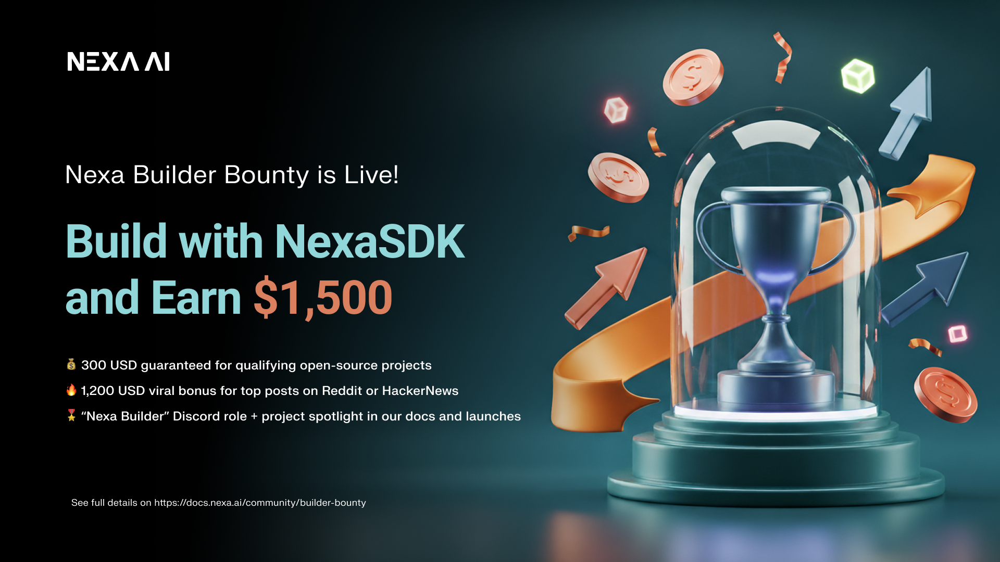

<div align="center" style="text-decoration: none;">
  
  <p style="font-size: 1.3em; font-weight: 600; margin-bottom: 20px;">
    <a href="README_zh.md"> 简体中文 </a>
    |
    <a href="README.md"> English </a>
  </p>
  <p style="font-size: 1.3em; font-weight: 600; margin-bottom: 20px;">🤝 NexaSDK端侧推理支持的芯片厂商 </p>
    <picture>
      <source srcset="assets/chipmakers-dark.png" media="(prefers-color-scheme: dark)">
      <source srcset="assets/chipmakers.png" media="(prefers-color-scheme: light)">
      
    </picture>
  </p>
  <p>
    <a href="https://www.producthunt.com/products/nexasdk-for-mobile?embed=true&utm_source=badge-top-post-badge&utm_medium=badge&utm_campaign=badge-nexasdk-for-mobile" target="_blank" rel="noopener noreferrer">
        
    </a>
    <a href="https://trendshift.io/repositories/12239" target="_blank" rel="noopener noreferrer">
        
    </a>
  </p>
  <p>
    <a href="https://docs.nexa.ai">
        
    </a>
    <a href="https://sdk.nexa.ai/wishlist">
        
    </a>
    <a href="https://x.com/nexa_ai"></a>
    <a href="https://discord.com/invite/nexa-ai">
        
    </a>
    <a href="https://join.slack.com/t/nexa-ai-community/shared_invite/zt-3837k9xpe-LEty0disTTUnTUQ4O3uuNw">
        
    </a>
  </p>
</div>

# NexaSDK —— 全模型支持，全硬件兼容

NexaSDK 是一款易用的开发者工具包，支持本地在 NPU、GPU 及 CPU 上运行任意 AI 模型——其技术核心是 **NexaML** 引擎，由 Nexa AI 团队从零自研，适配各类硬件推理，力求发挥 AI 模型推理的极致性能。与诸多简单集成第三方推理框架的工具不同，NexaML 是从底层架构从零搭建，可实现在 day-0 支持最新的前沿模型（包括大语言模型、视觉语言模型、计算机视觉模型、嵌入模型、重排序模型、语音识别模型、文本转语音模型等等）。NexaML 支持三种模型格式：GGUF、MLX 及 Nexa AI 自有 `.nexa` 格式。

### ⚙️ 差异化优势

<div align="center">

| 功能特性                           | **NexaSDK**                                     | **Ollama** | **llama.cpp** | **LM Studio** |
| ---------------------------------- | ----------------------------------------------- | ---------- | ------------- | ------------- |
| NPU 支持                           | ✅ NPU 优先                                     | ⚠️         | ⚠️            | ❌            |
| 安卓/iOS SDK 支持                  | ✅ NPU/GPU/CPU 兼容                             | ⚠️         | ⚠️            | ❌            |
| Linux 支持 (Docker 镜像)           | ✅                                              | ✅         | ✅            | ❌            |
| 全格式模型支持（GGUF, MLX, NEXA）  | ✅ 底层控制                                     | ❌         | ⚠️            | ❌            |
| 完全多模态支持                     | ✅ 图像、音频、文本                             | ⚠️         | ⚠️            | ⚠️            |
| 跨平台                             | ✅ 桌面、移动 (Android, iOS)、车载、IoT (Linux) | ⚠️         | ⚠️            | ⚠️            |
| 一行代码启动                       | ✅                                              | ✅         | ⚠️            | ✅            |
| OpenAI 兼容 API + Function calling | ✅                                              | ✅         | ✅            | ✅            |

<p align="center" style="margin-top:14px">
  <i>
      <b>图例：</b>
      <span title="全支持">✅ 支持</span> &nbsp; | &nbsp;
      <span title="部分支持">⚠️ 部分/有限支持</span> &nbsp; | &nbsp;
      <span title="不支持">❌ 不支持</span>
  </i>
</p>
</div>

## 最新进展

- 📣 **NexaSDK for Android** 被 [Qualcomm 博客](https://www.qualcomm.com/developer/blog/2025/11/nexa-ai-for-android-simple-way-to-bring-on-device-ai-to-smartphones-with-snapdragon) 评价为"将端侧 AI 引入 Snapdragon 智能手机的简易方案"，**NexaML 引擎** 被 [Qualcomm 博客](https://www.qualcomm.com/developer/blog/2025/09/omnineural-4b-nexaml-qualcomm-hexagon-npu) 称为"革新端侧 AI 推理"。
- 📣 发布 Nexa AI 全新 **AutoNeural-VL-1.5B**，该模型为车载场景设计的 NPU 原生视觉-语言模型，在 Qualcomm SA8295P 平台实现 **14×** 时延降低，**3×** 解码加速，**4×** 长上下文，现同样支持 Qualcomm X Elite 笔记本。
- 📣 支持 Mistral AI 最新 **Ministral-3-3B**，适配 Qualcomm Hexagon NPU、Apple 神经引擎、GPU 与 CPU。
- 📣 发布 **Linux SDK**，支持 NPU/GPU/CPU，详见 [Linux SDK 文档](https://docs.nexa.ai/nexa-sdk-docker/overview)。
- 📣 Apple Neural Engine 支持 [Granite-4.0](https://huggingface.co/NexaAI/Granite-4-Micro-ANE)、[Qwen3](https://huggingface.co/NexaAI/Qwen3-0.6B-ANE)、[Gemma3](https://huggingface.co/NexaAI/Gemma3-1B-ANE)、[Parakeetv3](https://huggingface.co/NexaAI/parakeet-tdt-0.6b-v3-ane)。[ANE 版获取](https://nexa-model-hub-bucket.s3.us-west-1.amazonaws.com/public/nexa_sdk/downloads/nexa-cli_macos_arm64_ane.pkg)。
- 📣 Android SDK 上线，支持 NPU/GPU/CPU，详情见 [Android SDK 文档](https://docs.nexa.ai/nexa-sdk-android/overview) 和 [Demo](bindings/android/README.md)。
- 📣 支持 **SDXL-turbo** 在 AMD NPU 上图像生成。参见 [AMD 官方博客：Nexa AI 实现 SDXL 图像生成](https://www.amd.com/en/developer/resources/technical-articles/2025/advancing-ai-with-nexa-ai--image-generation-on-amd-npu-with-sdxl.html)。
- 支持 Android **Python SDK**，支持 NPU/GPU/CPU。[Python SDK 文档](https://docs.nexa.ai/nexa-sdk-android/python) 及 [Demo](bindings/android/README.md)。
- 📣 Day-0 支持 Qwen3-VL-4B 和 8B（GGUF、MLX、.nexa 格式，NPU/GPU/CPU），是唯一 GGUF 格式全兼容框架。[Qwen 官方联合发布](https://x.com/Alibaba_Qwen/status/1978154384098754943)。
- 📣 Day-0 支持 IBM Granite 4.0（NPU/GPU/CPU）。[NexaML 引擎与 vLLM、llama.cpp、MLX 共同亮相 IBM 博客](https://x.com/IBM/status/1978154384098754943)。
- 📣 Day-0 支持 Google EmbeddingGemma（NPU）。[Google 官方致谢](https://x.com/googleaidevs/status/1969188152049889511)。
- 📣 完整支持 Gemma3n 视觉多模态（GGUF、GPU/CPU），为全球首个 [Gemma-3n](https://sdk.nexa.ai/model/Gemma3n-E4B) 多模态推理实现。
- 📣 **Intel NPU** 支持 [DeepSeek-r1-distill-Qwen-1.5B](https://sdk.nexa.ai/model/DeepSeek-R1-Distill-Qwen-1.5B-Intel-NPU) 与 [Llama3.2-3B](https://sdk.nexa.ai/model/Llama3.2-3B-Intel-NPU)
- 📣 **Apple Neural Engine** 实现 [Parakeet v3](https://sdk.nexa.ai/model/parakeet-v3-ane) 实时语音识别

# 快速开始

## 第一步：一键下载 Nexa CLI

### Windows

- [支持 Qualcomm NPU 的 arm64 版本](https://public-storage.nexa4ai.com/nexa_sdk/downloads/nexa-cli_windows_arm64.exe)
- [支持 Intel / AMD NPU 的 x86_64 版本](https://public-storage.nexa4ai.com/nexa_sdk/downloads/nexa-cli_windows_x86_64.exe)

### Linux

#### arm64 平台 （适配高通 NPU）：

```bash
curl -fsSL https://github.com/NexaAI/nexa-sdk/releases/latest/download/nexa-cli_linux_arm64.sh -o install.sh && chmod +x install.sh && ./install.sh && rm install.sh
```

#### x86_64 平台：

```bash
curl -fsSL https://github.com/NexaAI/nexa-sdk/releases/latest/download/nexa-cli_linux_x86_64.sh -o install.sh && chmod +x install.sh && ./install.sh && rm install.sh
```

### macOS

- [支持 MLX / ANE 的 arm64 版本](https://public-storage.nexa4ai.com/nexa_sdk/downloads/nexa-cli_macos_arm64.pkg)
- [x86_64 版本](https://public-storage.nexa4ai.com/nexa_sdk/downloads/nexa-cli_macos_x86_64.pkg)

#### 卸载

```bash
sudo rm -r /opt/nexa_sdk
sudo rm /usr/local/bin/nexa
# 如需完全清除数据
# rm -r $HOME/.cache/nexa.ai
```

## 第二步：一行命令运行模型

你可以直接用 `nexa infer <完整repo名>` 从 🤗 Hugging Face 下载并运行任何兼容的 GGUF、MLX、nexa 格式模型。

### GGUF 模型

> [!TIP]
> GGUF 可在 macOS、Linux 和 Windows 的 CPU/GPU 上运行。部分 GGUF 特殊模型只由 NexaSDK 支持（如 DeepSeek-OCR）。

📝 举例：运行 Qwen3 大语言模型

```bash
nexa infer ggml-org/Qwen3-1.7B-GGUF
```

🖼️ 多模态模型（Qwen3-VL-4B）：

```bash
nexa infer NexaAI/Qwen3-VL-4B-Instruct-GGUF
```

### MLX 模型

> [!TIP]
> MLX 仅支持 Apple Silicon（macOS），Hugging Face mlx-community 大多数模型质量堪忧，建议首选 NexaAI 官方策划[模型集](https://huggingface.co/NexaAI/collections)

📝 举例：运行 Qwen3 大语言模型

```bash
nexa infer NexaAI/Qwen3-4B-4bit-MLX
```

🖼️ 多模态模型（Gemma3n）：

```bash
nexa infer NexaAI/gemma-3n-E4B-it-4bit-MLX
```

### Qualcomm NPU 模型

> [!TIP]
> 需下载 [支持 Qualcomm NPU 的 arm64 版本](https://public-storage.nexa4ai.com/nexa_sdk/downloads/nexa-cli_windows_arm64.exe)，同时设备需内置 Snapdragon® X Elite 芯片。

#### 快速开始（Windows arm64, Snapdragon X Elite）

1. **登录并获取访问令牌（Pro 模型需授权）**

   - 在 [sdk.nexa.ai](https://sdk.nexa.ai) 创建账户
   - 前往 “Deployment → Create Token”
   - 终端运行（用你的 Token 替换）：
     ```bash
     nexa config set license '<your_token_here>'
     ```

2. 运行 NexaAI 全新多模态模型 OmniNeural-4B 或其他 NPU 推理模型

```bash
nexa infer NexaAI/OmniNeural-4B
nexa infer NexaAI/Granite-4-Micro-NPU
nexa infer NexaAI/Qwen3-VL-4B-Instruct-NPU
```

## CLI 命令速查

| 常用命令                            | 说明                       |
| ----------------------------------- | -------------------------- |
| `nexa -h`                           | 展示所有 CLI 命令          |
| `nexa pull <repo>`                  | 交互式下载与模型缓存       |
| `nexa infer <repo>`                 | 本地推理                   |
| `nexa list`                         | 显示所有缓存模型及体积     |
| `nexa remove <repo>` / `nexa clean` | 删除单个/全部缓存模型      |
| `nexa serve --host 127.0.0.1:8080`  | 启动 OpenAI 兼容 REST 服务 |
| `nexa run <repo>`                   | 通过服务器与模型聊天       |

👉 多模态模型推理支持直接在 CLI 拖入图片、音频 - 你甚至可以一次拖入多张图片！

详见 [CLI 指令全览](https://nexaai.mintlify.app/nexa-sdk-go/NexaCLI)。

### 从本地文件系统导入模型

```bash
# hf download <model> --local-dir /path/to/modeldir
nexa pull <model> --model-hub localfs --local-path /path/to/modeldir
```

## 🎯 你决定下一个支持的模型

**[Nexa Wishlist](https://sdk.nexa.ai/wishlist)** —— 申请、投票你想本地部署的模型。

提交 Hugging Face repo ID，选择你希望的后端格式（GGUF、MLX 或面向 Qualcomm/Apple NPU 的 Nexa 格式），社区投票最多的模型优先上线！

👉 **[立即投票](https://sdk.nexa.ai/wishlist)**

## 鸣谢

特别感谢以下项目：

- [ggml](https://github.com/ggml-org/ggml)
- [mlx-lm](https://github.com/ml-explore/mlx-lm)
- [mlx-vlm](https://github.com/Blaizzy/mlx-vlm)
- [mlx-audio](https://github.com/Blaizzy/mlx-audio)

## 加入 Builder Bounty 计划

使用 NexaSDK 构建作品可获得高达 1,500 美元奖励！



了解更多：[参与细则](https://docs.nexa.ai/community/builder-bounty)。
