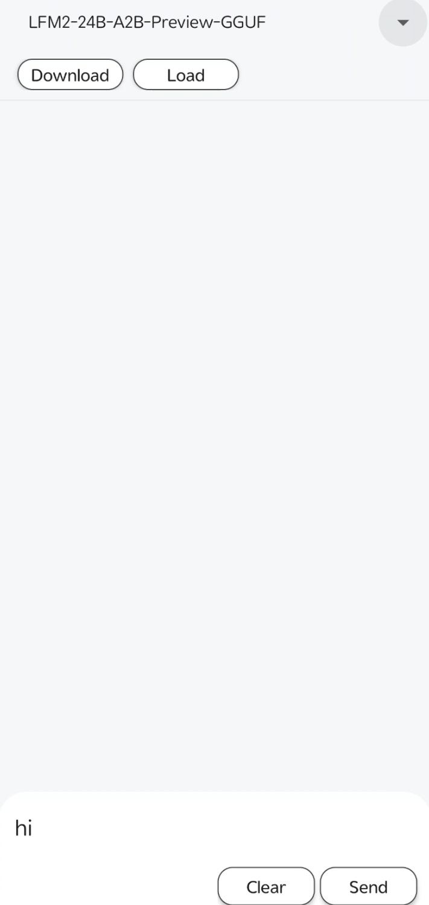
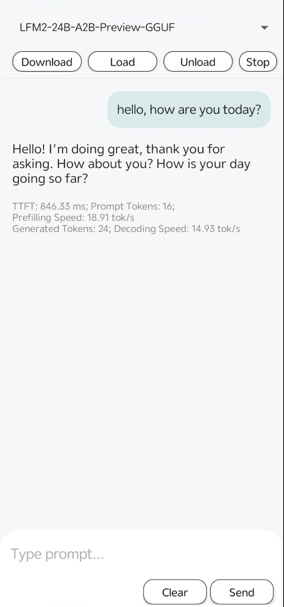

# Nexa Android SDK Demo App

[](https://www.producthunt.com/products/nexasdk-for-mobile)

> 📣 **NexaSDK for Android** is highlighted by [Qualcomm blog](https://www.qualcomm.com/developer/blog/2025/11/nexa-ai-for-android-simple-way-to-bring-on-device-ai-to-smartphones-with-snapdragon) as "a simple way to bring on-device AI to smartphones with Snapdragon"

## Overview

The Nexa AI Android SDK enables on-device AI inference for Android applications with NPU acceleration. Run Large Language Models (LLMs), Vision-Language Models (VLMs), Embeddings, Speech Recognition (ASR), Reranking, and Computer Vision models on Android devices with support for NPU, GPU, and CPU inference. 

📖 For full documentation, see [Android SDK Doc](https://docs.nexa.ai/en/nexa-sdk-android/overview).

## Device Compatibility

### Supported Hardware

| Component | Requirement |
|-----------|-------------|
| **NPU** | Qualcomm Snapdragon 8 Gen 4 (optimized) |
| **GPU** | Qualcomm Adreno GPU |
| **CPU** | ARM64-v8a |
| **RAM** | 4GB+ recommended |
| **Storage** | 100MB - 4GB (varies by model) |

### Minimum Requirements

- Android API Level 27+ (Android 8.1 Oreo)
- Architecture: ARM64-v8a

## Quick Start with APK

### Standard Demo App

Download and install the pre-built APK:

```bash
# Download: https://nexa-model-hub-bucket.s3.us-west-1.amazonaws.com/public/android-demo-release/nexaai-demo-app.apk
adb install nexaai-demo-app.apk
```

### GPT-OSS NPU Demo

For running GPT-OSS model on Qualcomm NPU:

```bash
# Download: https://nexa-model-hub-bucket.s3.us-west-1.amazonaws.com/public/nexa_sdk/huggingface-models/gpt-oss-android-demo/nexaai-gpt-oss-npu.apk
adb install nexaai-gpt-oss-npu.apk
```

## Build from Source

> 🎬 Watch the [tutorial video](https://www.linkedin.com/feed/update/urn:li:activity:7394055404562935809) showing how to run the sample app in 40 seconds.

### Step-by-Step Instructions

1. **Clone the repository**

   ```bash
   git clone https://github.com/NexaAI/nexa-sdk/
   ```

2. **Open in Android Studio**
   
   Open the `bindings/android` folder in Android Studio.

3. **Download a model**
   
   Follow the [Android SDK Doc](https://docs.nexa.ai/en/nexa-sdk-android/overview) to download a model. Below are some examples to download:
   - [Granite-4.0-h-350M-NPU](https://huggingface.co/NexaAI/Granite-4.0-h-350M-NPU-mobile)
   - [Granite-4-Micro-NPU](https://huggingface.co/NexaAI/Granite-4-Micro-NPU-mobile)
   - [OmniNeural-4B](https://huggingface.co/NexaAI/OmniNeural-4B-mobile)
   
   Place the model in the app's data directory:
   ```
   /data/data/com.nexa.demo/files/models/<model-name>
   ```

4. **Build and run** the app in Android Studio

## Tutorial: LFM2-24B-A2B-Preview-GGUF

This walkthrough uses the [LFM2-24B-A2B-Preview-GGUF](https://huggingface.co/NexaAI/LFM2-24B-A2B-Preview-GGUF) model in the demo app.

1. **Install the app**  
   Install the demo app (APK or build from source as above).

2. **Select the model**  
   Open the model selector (dropdown next to the model name) and choose **LFM2-24B-A2B-Preview-GGUF**.

   

3. **Download**  
   Tap **Download** to fetch the model to your device. Wait until the download finishes.

4. **Load**  
   Tap **Load**. A **load model config** dialog appears: choose **CPU**, **GPU**, or **NPU** (for Qualcomm NPU), then tap **SURE**. Once the model is loaded, the chat area becomes available.

   

5. **Chat**  
   Type your message in the input field at the bottom, then tap **Send** to get a response. Use **Clear** to clear the input or conversation as needed.

   
