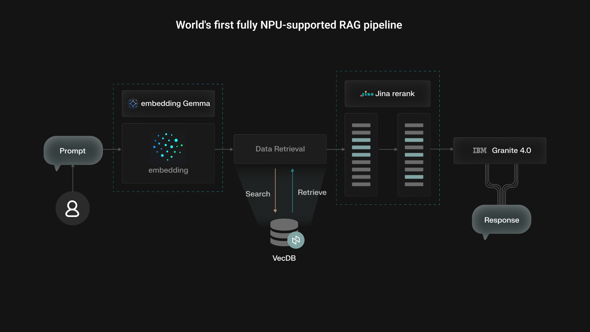

# World's First Fully NPU-Supported RAG Pipeline

## 1. About

This is the **world's first fully NPU-supported Retrieval-Augmented Generation (RAG)** system that runs entirely on Neural Processing Units without cloud connectivity. The pipeline combines three state-of-the-art open models optimized for on-device inference:

- **Embedding-Gemma-300M**: Google's top multilingual text embedding model (ranked highest on MTEB benchmark)
- **Jina Reranker v2 (278M)**: Next-generation reranker delivering SOTA performance across multilingual retrieval
- **Granite 4.0-Micro (3B)**: IBM's compact LLM offering frontier-level reasoning for on-device inference



**Key Benefits:**
- 🔒 **Private**: All processing happens locally—no data leaves your device
- ⚡ **Fast**: NPU-optimized inference with low-latency retrieval
- 🔋 **Efficient**: Power-efficient execution compared to GPU/CPU solutions
- 📄 **Flexible**: Supports PDFs, Word docs, and text files

The system is powered by **NexaML** inference framework with OpenAI-compatible APIs and runs on a proprietary local database engine optimized for on-device use.

## 2. Prerequisites

**Hardware:** Windows ARM64 device with NPU support  
**Software:** Nexa SDK for Windows ARM64

### Install Models

Download the required NPU-optimized models:

```bash
nexa pull NexaAI/embeddinggemma-300m-npu
nexa pull NexaAI/jina-v2-rerank-npu
nexa pull NexaAI/Granite-4-Micro-NPU
```

### Start Nexa Server

Launch the server in a separate terminal:

```bash
nexa serve
```

### Setup Environment

```bash
# Create conda environment (optional)
conda create -n rag-nexa python=3.10 -y
conda activate rag-nexa

# Install dependencies
pip install -r requirements.txt
```

## 3. Usage

### CLI Mode

Run the RAG pipeline from command line:

```bash
python rag_nexa.py --data docs/ --rebuild
```

**Adding Documents:**
- Place files in `./docs` folder (supports `.pdf`, `.txt`, `.docx`)
- Use `--rebuild` flag to re-index after adding new files

### Gradio UI Mode

Launch the interactive web interface:

```bash
python gradio_ui.py
```

Open your browser at [http://127.0.0.1:7860](http://127.0.0.1:7860)

**Features:**
- Upload files through the UI
- Rebuild index with one click
- Chat interface with streaming responses
- Real-time RAG over your documents

## 4. References
- [Embedding-Gemma-300M-NPU](https://sdk.nexa.ai/model/embeddinggemma-300m-npu)
- [Jina Reranker v2 NPU](https://sdk.nexa.ai/model/Jina-reranker-v2)
- [Granite 4.0-Micro NPU](https://sdk.nexa.ai/model/Granite-4-Micro)
**Powered by:** [Nexa SDK](https://github.com/NexaAI/nexa-sdk) 
