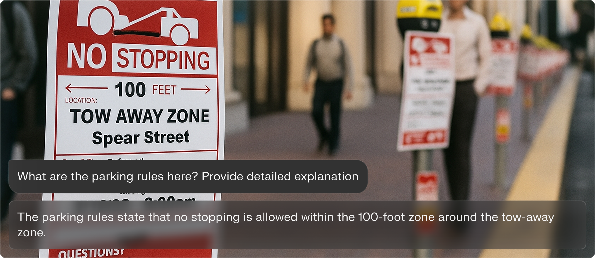
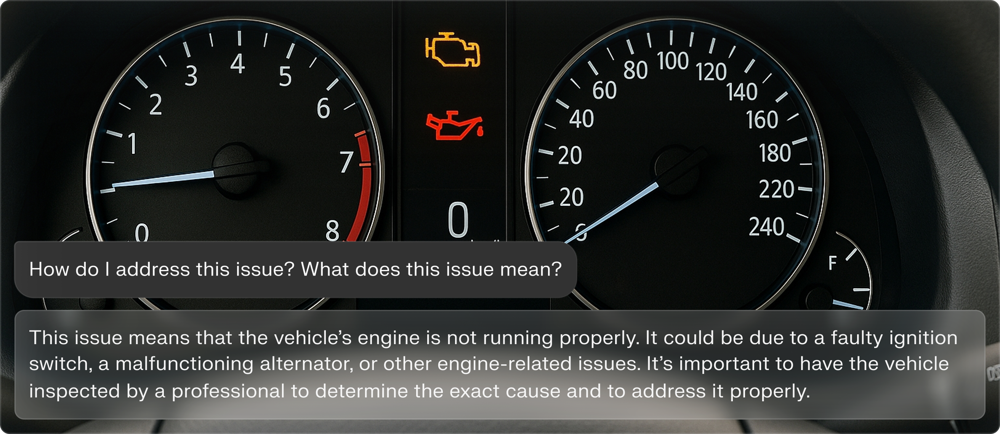
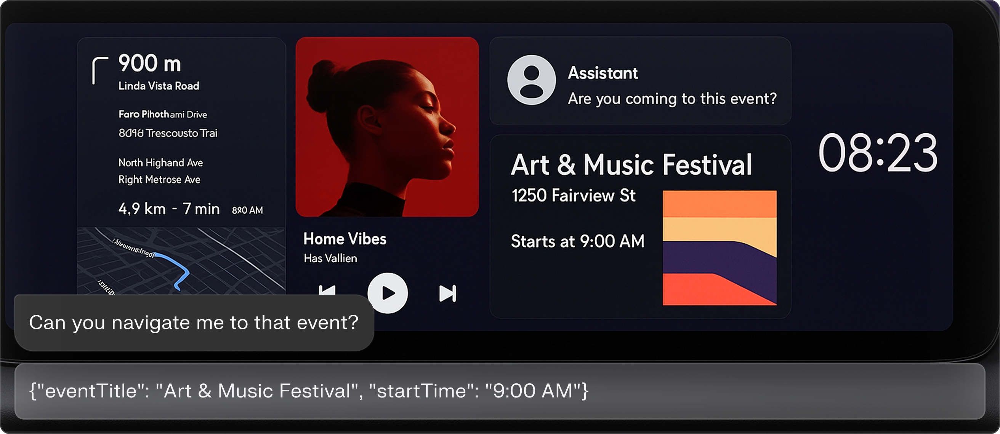

# AutoNeural – NPU-Native Multimodal Model for Automotive Cockpits

<p align="center">
  
</p>

<p align="center">
  <a href="https://huggingface.co/NexaAI/AutoNeural"></a>
  <a href="https://arxiv.org/abs/2512.02924"></a>
  <br>
  <a href="https://discord.com/invite/nexa-ai"></a>
  <a href="https://x.com/nexa_ai"></a>
</p>

> **AutoNeural** is an NPU-native vision–language model for in-car assistants, co-designed with a MobileNetV5 encoder and a hybrid Liquid AI 1.2B backbone to deliver **real-time multimodal understanding on Qualcomm SA8295P NPU**. It runs 768×768 images, cuts end-to-end latency by up to **14×**, and improves quantization error by **7×** compared to ViT–Transformer baselines on the same hardware.

### ✨ Key features

- **NPU-native co-design** – MobileNet-based vision encoder + hybrid Transformer–SSM backbone, built for INT4/8/16 and NPU operator sets.
- **Real-time cockpit performance** – Up to **14× lower TTFT**, ~3× faster decode, and 4× longer context (4096 vs 1024) on Qualcomm SA8295P NPU.
- **High-resolution multimodal perception** – Supports **768×768** images with ~45 dB SQNR under mixed-precision quantization (W8A16 vision, W4A16 language).
- **Automotive-tuned dataset** – Trained with **200k** proprietary cockpit samples (AI Sentinel, Greeter, Car Finder, Safety) plus large-scale Infinity-MM instruction data.
- **Production-focused** – Designed for always-on, low-power, privacy-preserving deployment in real vehicles.

---

## 📚 Table of Contents

- [Examples](#-examples)
- [Quickstart](#-quickstart)
- [Performance](#-performance)
- [Citation](#-citation)
- [License](#-license)
- [Enterprise Deployment](#-contact-sales)

---

## 🎬 Examples

These are core scenarios AutoNeural is designed for.

### 1. In-Cabin Detection

Detect risky behaviors and situations in the cabin, such as driver distraction, drowsiness, children seated unsafely, or passengers blocking visibility.

<p align="center">
  
</p>

---

### 2. Out-Cabin Awareness

Read real-world parking signs and surrounding context to answer "Can I park here?" type questions.

<p align="center">
  
</p>

---

### 3. HMI & Dashboard Understanding

Understand dashboards, warning lights, and infotainment UIs and explain them in natural language.

<p align="center">
  
</p>

---

### 4. Visual + Conversational Agentic Tasks

Ground natural language requests in visual context and emit structured outputs that your app can consume.

<p align="center">
  
</p>

---

## 🚀 Quickstart

> ⚠️ **Hardware Requirement:** AutoNeural is optimized for **Qualcomm NPUs**.

The easiest way to get started with AutoNeural is through our interactive Jupyter notebook:

## 📓 **[Open Quickstart Notebook](./quickstart.ipynb)**

## 📊 Performance

### Vision encoder latency on Qualcomm SA8295P NPU

AutoNeural uses a **MobileNetV5-style encoder** with depthwise separable convolutions, achieving large latency gains over a ViT encoder of similar size.

| Resolution | InternViT-300M (ViT) | AutoNeural Vision Encoder (300M) |   Speedup   |
| :--------: | :------------------: | :------------------------------: | :---------: |
|  256×256   |       163.3 ms       |             28.0 ms              |    5.8×     |
|  512×512   |      1415.0 ms       |             101.7 ms             |     14×     |
|  768×768   | not supported (OOM)  |             278.1 ms             | ✓ real-time |

### End-to-end system comparison (SA8295P NPU)

| Metric                 | InternVL 2B (baseline) | AutoNeural-VL |
| :--------------------- | :--------------------: | :-----------: |
| TTFT (1× 512² image)   |         ~1.4 s         |  **~100 ms**  |
| Max image size         |        448×448         |  **768×768**  |
| SQNR                   |         28 dB          |   **45 dB**   |
| RMS quantization error |         3.98%          |  **0.562%**   |
| Decode throughput      |       ~15 tok/s        | **~44 tok/s** |
| Context length         |          1024          |   **4096**    |

> 📝 These numbers are measured on-device with mixed precision (vision: W8A16; language: W4A16), not simulation.

---

## 📖 Citation

If you use AutoNeural in your research, please cite:

```bibtex
@article{chen2025autoneural,
  title   = {AutoNeural: Co-Designing Vision--Language Models for NPU Inference},
  author  = {Wei Chen and Liangmin Wu and Yunhai Hu and Zhiyuan Li and Zhiyuan Cheng and
             Yicheng Qian and Lingyue Zhu and Zhipeng Hu and Luoyi Liang and Qiang Tang and
             Zhen Liu and Han Yang},
  journal = {arXiv preprint arXiv:2512.02924},
  year    = {2025}
}
```

---

## 📄 License

This repo is licensed under the **Creative Commons Attribution–NonCommercial 4.0 (CC BY-NC 4.0)** license, which allows use, sharing, and modification only for non-commercial purposes with proper attribution.

All NPU-related models, runtimes, and code in this project are protected under this non-commercial license and cannot be used in any commercial or revenue-generating applications.

> 💼 Commercial licensing or enterprise usage requires a separate agreement.

---

## 💼 Contact Sales

For enterprise deployment, custom integrations, or licensing inquiries:

📅 **[Book a Call with Us](https://nexa.ai/book-a-call)**
