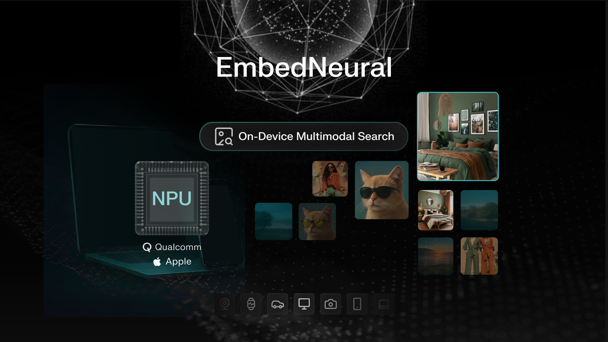

# EmbedNeural – NPU-Native Multimodal Search for Mobile, IoT and PC

<p align="center">
  
</p>

- 📖 **[Blog Post](https://nexa.ai/blogs/EmbedNeural)**
- 🎬 **[Demo on Qualcomm](https://youtu.be/iy2X6bJHl1E)**
- 🎬 **[Demo on Apple](https://youtu.be/W077X06ypPQ)**

> **EmbedNeural** is an NPU-native multimodal embedding model designed for on-device image and text search, optimized for **Apple and Qualcomm NPUs**. It enables efficient, privacy-preserving semantic search directly on mobile, IoT, and PC devices—no cloud required.

### ✨ Key Features

- **NPU-native architecture** – Purpose-built for Apple Neural Engine and Qualcomm Hexagon NPU, maximizing hardware efficiency.
- **Multimodal search** – Supports searching across text, images, and audio with unified embeddings.
- **Privacy-preserving** – All processing happens locally on-device, ensuring data never leaves the user's hardware.
- **Cross-platform support** – Runs on mobile (iOS/Android), IoT devices, and PC with Apple Silicon or Qualcomm chips.
- **Low latency** – Optimized quantization and NPU-friendly operators deliver real-time search performance.

---

## 📚 Table of Contents

- [Use Cases](#-use-cases)
- [Quickstart](#-quickstart)

---

## 🎯 Use Case Examples

### Phone: Meme Library Search

Your embarrassing screenshots, personal photos, and saved designs never touch the cloud. Visual search runs 100% locally.

<p align="center">
  
</p>

### Laptop: Visual Reference Library

EmbedNeural turns your chaotic image library into an instantly searchable visual database—without compromising speed, privacy, or battery life.

<p align="center">
  
</p>

---

## 🚀 Quickstart

> ⚠️ **Hardware Requirement:** EmbedNeural is optimized for **Apple Neural Engine** and **Qualcomm Hexagon NPU**.

### Step 1: Pull the Model

```bash
nexa pull NexaAI/EmbedNeural
```

### Step 2: Start Nexa Serve

```bash
nexa serve
```

### Step 3: Install Dependencies

```bash
pip install -r requirements.txt
```

### Step 4: Launch the Demo

```bash
python gradio_ui.py
```
